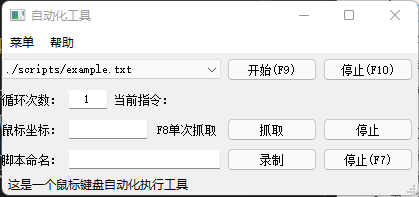

# autogui

类似按键精灵，可以根据脚本实现对鼠标键盘的自动化操作。脚本可以通过录制也可以自己编写。
源码通过python编写，使用模块pyautogui来操作键盘鼠标和识别图片，使用pyWinhook模块来监听鼠标和键盘实现快捷键和录制的功能，使用PYQT5来实现界面。


## 环境
如果需要通过源码执行或者想自定义修改则需要安装以下的包，python使用的是3.9.6

* pyautogui [文档](https://pyautogui.readthedocs.io/en/latest/screenshot.html)
```
pip install pyautogui
```

* pyqt5
```
pip install pyqt5
```

* loguru
```
pip install loguru
```

* opencv
图片匹配度参数需要，不安装也不会报错，只是无法使用图片匹配功能
```
pip install opencv-python
```

* pyWinhook
用于监听鼠标键盘的输入，直接安装会报错，需要手动去下载。
下列命令是查看设备支持的版本
```
pip debug --verbose
```
在[pywinhook下载页](https://www.lfd.uci.edu/~gohlke/pythonlibs/#pywinhook)找到自己对应的版本进行下载，然后安装
```
 pip install .\pyWinhook-1.6.2-cp39-cp39-win_amd64.whl
```
在pk文件夹中已经放置了我使用的安装包

* 使用requirements
也可以一键全部安装
```
pip install -r requirements.txt 
```

## 最新版本的使用

### 不需要界面直接命令行运行脚本
* 如果使用命令行则需要安装上面的环境
示例：
```
 python .\autogui.py .\scripts\000.txt 1
```
载入000.txt脚本，循环1次，按F9启动，按F10退出

### 界面
* 下载exe直接点开即用，或者安装环境后执行python .\autogui.py

界面：


* 第一行为脚本的选择，启动脚本和停止脚本，脚本被保存在执行程序地址下的scripts目录中
* 第二行显示需要执行脚本的循环次数，需要在开始前修改，运行中修改无效
* 第三行是为了方便自己写脚本的小工具，用于抓取鼠标点的坐标
* 第四行为录制功能，填入新脚本名字后点击录制，可以记录所有鼠标和键盘操作（快捷键除外），然后点击F7结束录制，脚本自动保存，可以直接通过第一行选择启用。
* 可通过编辑config.ini修改快捷键和图片匹配度，没有此文件则使用默认参数
* 菜单里面可以打开配置文件或者应用配置文件，帮助里面可以生成示例脚本

### 脚本编写
```
 [3000,"keyboard","down","a"],
```
* 参数1：3000表示按压前将延迟3秒钟

* 参数2:

|参数2的值|说明|
|---|---|
|keyboard|键盘操作|
|mouse|鼠标操作|
|pic|寻找图片的点击操作|
|ifpic|寻找图片的条件语句|
* 参数3：根据上面命令不同此处也不同

如果参数2是按键keyboard:

|参数3的值|说明|
|---|---|
|down|按下|
|up|抬起|
|txt|输入文本|

如果参数2是鼠标mouse:

|参数3的值|说明|
|---|---|
|left down|左按下|
|left up|左抬起|
|right down|右按下|
|right up|右抬起|
|move|单纯移动|

如果参数2是识别图片pic:

|参数3的值|说明|
|---|---|
|left click|左单击|
|right click|右单击|
|left D click|左双击|

如果参数2是识别图片ifpic:

|参数3的值|说明|
|---|---|
|true|存在|
|false|不存在|
|end|结束判断|


* 参数4：如果是按键则其值就为键值或文本，如果是鼠标则值为横坐标，纵坐标，如果是寻找图片，则是其地址


按键示例：

```
 [5000,"keyboard","down","Lwin"],
 [81,"keyboard","up","Lwin"],
```

鼠标示例：
```
 [708,"mouse","move",[1007,546]],
 [202,"mouse","move",[955,587]],
 [205,"mouse","move",[938,611]],
 [207,"mouse","move",[922,636]],
 [203,"mouse","move",[918,641]],
 [156,"mouse","left down",[918,642]],
 [107,"mouse","left up",[918,642]],
```

图片示例：
```
 [3000,"pic","left click","./scripts/tp1.png"]
```

图片判断示例：
```
 [3000,"ifpic","True","./scripts/youdao.png"],
 [100,"keyboard","down","1"],
 [100,"keyboard","up","1"],
 [0,"ifpic","end",""],
 [3000,"ifpic","False","./scripts/youdao.png"],
 [100,"keyboard","down","2"],
 [100,"keyboard","up","2"],
 [0,"ifpic","end",""],
 [100,"keyboard","txt","over"]
```

### 打包

抛弃之前用虚拟环境打包，直接
```
pyinstaller -Fw .\autogui.py --paths="C:\Users\dell\AppData\Local\Programs\Python\Python39\Lib\site-packages\cv2"
```

## 版本说明

### v1.5
增加按键，刷新脚本选择下拉框
配置文件中增加脚本路径的字段
帮助里添加脚本编写说明网页快链
现在picif下面可以增加多条语句
处理了UI显示当前执行命令不完整的问题

### V1.4
增加了图片识别判断语句
增加了当脚本停止执行时自动恢复窗体
修复打包的EXE无法识别图片的BUG

### V1.3
增加空格键的录制
增加消息栏的显示信息

### V1.2
增加菜单栏，主要是方便单独使用exe的时候建立配置文件和示例脚本
压缩了exe文件大小

### V1.1
新添加config.ini配置，可以修改快捷键和图像识别度

### V1
完成设想的所有功能

### V0.5.1
修复已知BUG

### V0.5
增加了鼠标事件录制，使用和之前一样，就是录制的时候会把鼠标点击和移动一起录了

### V0.4.1
修复录制事件只要down照成在某些软件中无法正常复现操作的问题，也就是手工在每次变化的时候加上一个up。
其他和V4相同

### 当前版本V0.4
增加了按键录制功能
#### 使用
启动窗体，如果想用之前版本的方式，就直接加参数即可，无参数则是窗体版本
```
python .\autogui.py
```
如果需要生成exe可执行
```
pyinstaller -F  autogui.py --noconsole 
```
界面如下

* 下拉框选择脚本，脚本文件夹还是scripts，需要自己去写，每次启动软件的时候回去读取里面的内容。
* 启用和停止可以通过快捷键也可以直接点
* 次数默认1，填写0则无限循环
* 当前指令就是脚本执行到哪一行咯
* 鼠标坐标那里是为了方便写脚本时需要抓取屏幕位置。
* 脚本名的输入框是当停止录制是另存为的名称，文件仍然保存到scripts文件夹里面
* 点击录制后窗体会最小化，然后会记录输入的所有按键操作

### V0.3
增加了窗体，可以之间点点点，不用输入命令了
#### 使用
启动窗体，如果想用之前版本的方式，就直接加参数即可，无参数则是窗体版本
```
python .\autogui.py
```
如果需要生成exe可执行
```
pyinstaller -F  autogui.py --noconsole
```
界面如下

* 下拉框选择脚本，脚本文件夹还是scripts，需要自己去写，每次启动软件的时候回去读取里面的内容。
* 启用和停止可以通过快捷键也可以直接点
* 次数默认1，填写0则无限循环
* 当前指令就是脚本执行到哪一行咯
* 鼠标坐标那里是为了方便写脚本时需要抓取屏幕位置。

### V0.2
更新了鼠标移动和点击

#### 写脚本
增加了三种鼠标操作，移动左击，移动右击和单纯移动
```
 [3000,"mouse","left",[1235,43]],  
 [1000,"mouse","move",[387,370]], 
 [1000,"mouse","right",[387,370]], 
```
其中的X,Y坐标可以在打开程序的后，使用F8来获取当前鼠标坐标

#### 启动程序

```
python .\autogui.py .\scripts\test.txt 1
```

#### 快捷键

|键位|功能|
|---|---|
|F8|获取当前鼠标坐标点|
|F9|启动脚本|
|F10|关闭程序|

### V0.1

#### 写脚本
首先编写单次执行脚本，说明可见doc/scripts.md，目前该版本只支持键盘输入
该示例就是按压a和b，然后输入test
```
[
 [3000,"keyboard","down","a"],
 [121,"keyboard","up","a"],
 [263,"keyboard","down","b"],
 [112,"keyboard","up","b"],
 [112,"keyboard","txt","test"],
]
```

#### 启动程序
然后命令启动，需要输入两个参数，第一个是脚本地址，第二个是运行次数，如果为0则无限执行
```
python .\autogui.py .\scripts\test.txt 1
```

#### 启动脚本
键盘按压F9则会按照输入的次数执行脚本，完毕后可以依旧点击F9来再次执行，按压F10则停止并且退出程序
